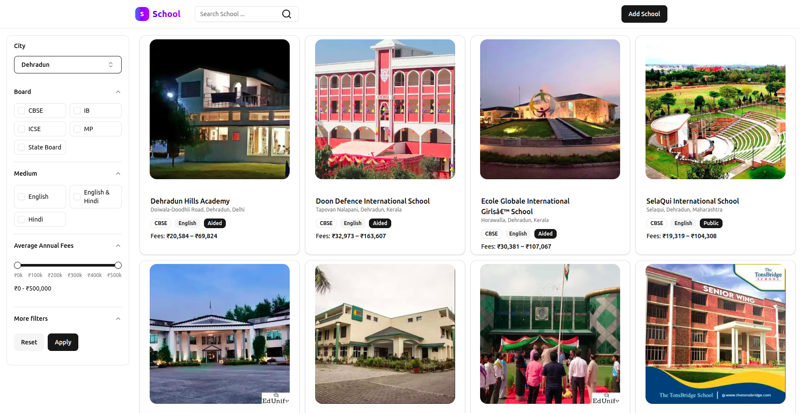
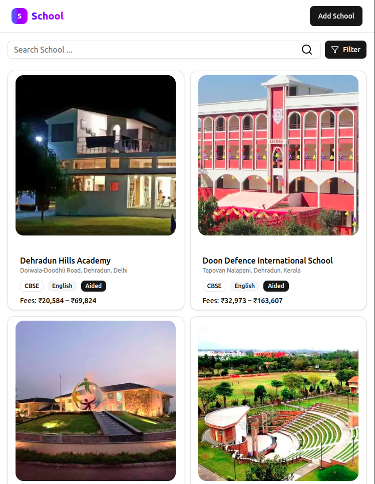
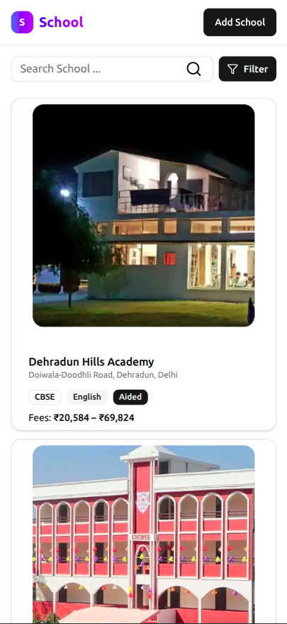
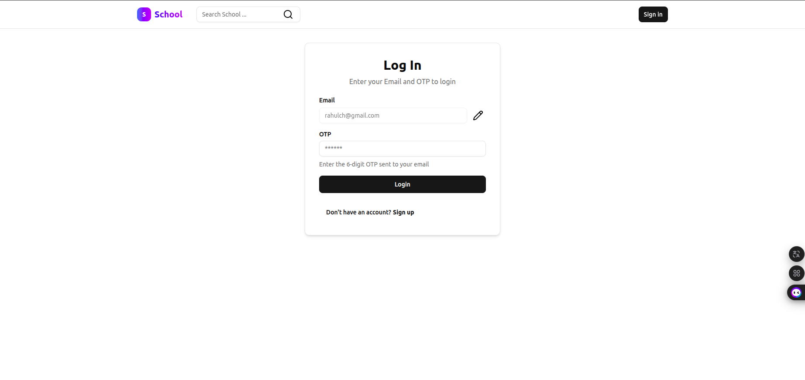
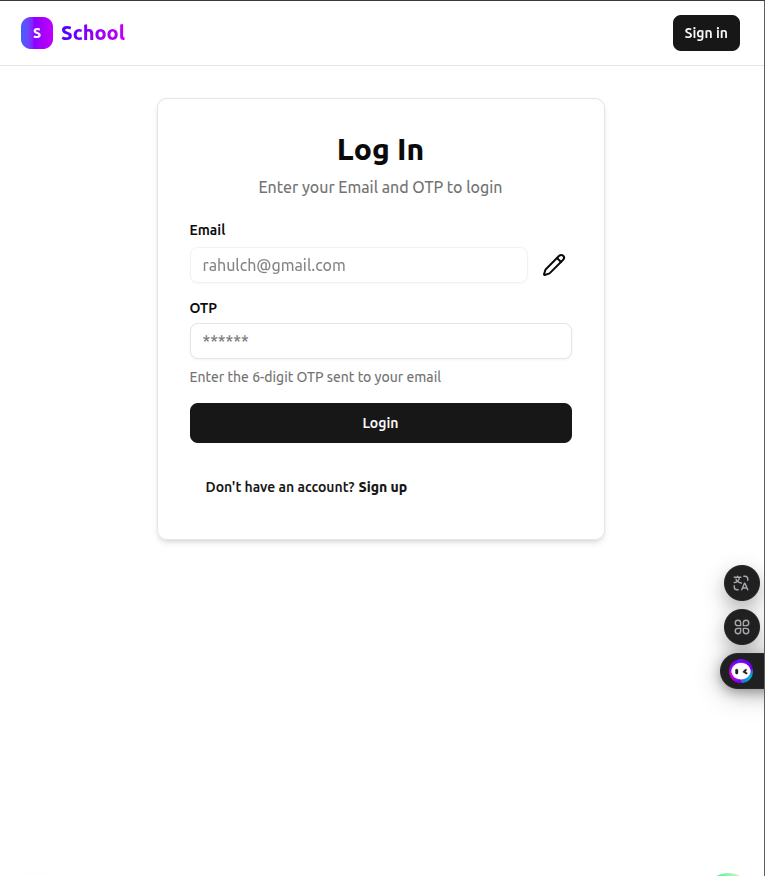
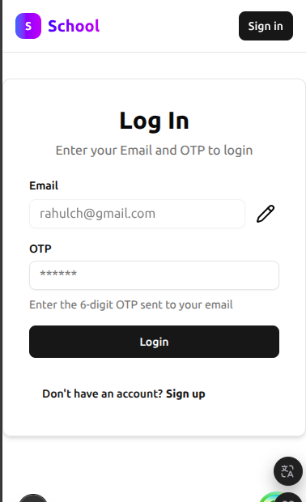
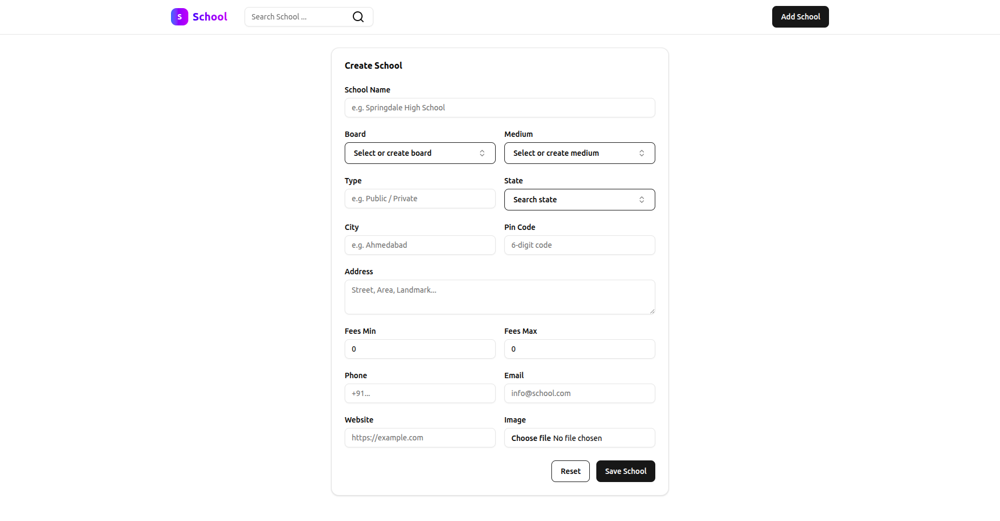
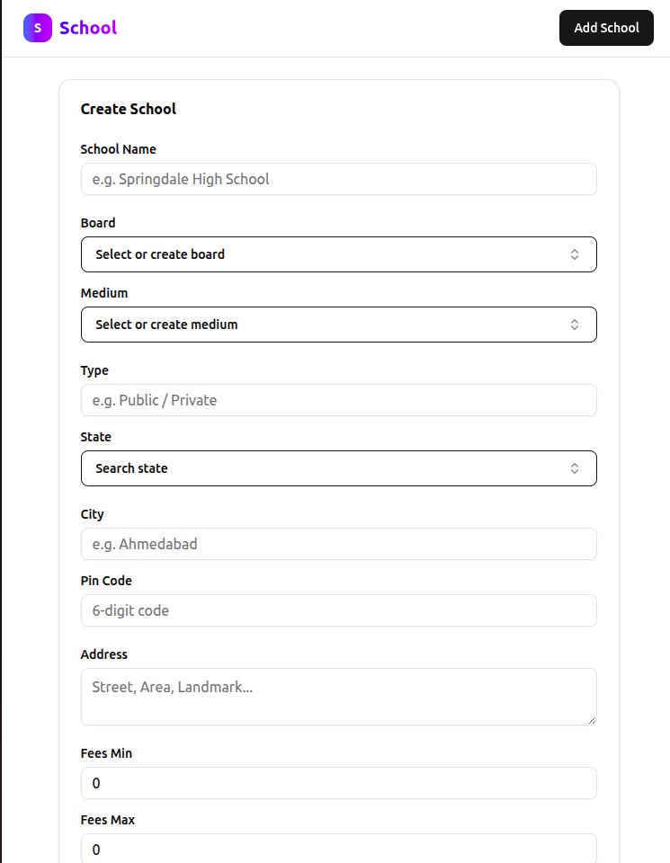
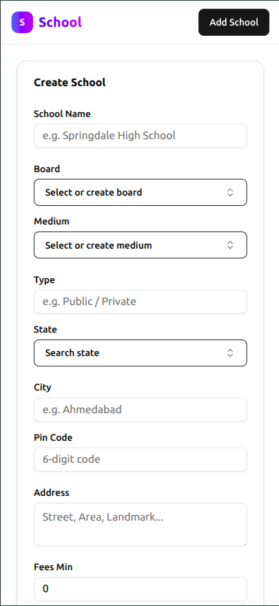

# 🏫 School Directory Demo

A demo application to **add, manage, and search schools**.
Built with **Next.js**, **MySQL**, **React Hook Form**, **Zod Validator**, **Drizzle ORM**.

---

## 🚀 Features

- 📱 **Responsive UI** (mobile, tablet, desktop) with ShadCN UI
- 📝 **School registration form** with validation (React Hook Form + Zod)
- 🔍 **Search schools** by name, city, board, or medium
- 🖼️ **Image upload** using Cloudinary
- ⚡ **API backend with Next.js and Hono.js**
- 🗄️ **MySQL database** with Drizzle ORM migrations and seed scripts
- 🎨 Clean, modern, and accessible UI

---

## 🛠️ Tech Stack

- **Frontend**: [Next.js](https://nextjs.org), [ShadCN UI](https://ui.shadcn.com), [React Hook Form](https://react-hook-form.com), [Zod](https://zod.dev)
- **Backend**: [Next.js](https://nextjs.org/), [Hono.js](https://hono.dev) API routes
- **Database**: MySQL + [Drizzle ORM](https://orm.drizzle.team)
- **File Uploads**: [Cloudinary](https://cloudinary.com)
- **Other Tools**: Tailwind CSS, TypeScript

---

## 📸 Screenshots

### Hero Page

|                     Desktop                      |                     Tablet                     |                     Mobile                     |
| :----------------------------------------------: | :--------------------------------------------: | :--------------------------------------------: |
|  |  |  |

### Auth Page

|                     Desktop                     |                      Tablet                      |                      Mobile                      |
| :---------------------------------------------: | :----------------------------------------------: | :----------------------------------------------: |
|  |  |  |

---

### Add School Page

|                          Desktop                           |                          Tablet                          |                          Mobile                          |
| :--------------------------------------------------------: | :------------------------------------------------------: | :------------------------------------------------------: |
|  |  |  |

---

## 📂 Folder Structure

```
school-demo/
├── src/
│   ├── app/               # Next.js app router
│   ├── features/          # School, Search, Upload modules
│   ├── components/        # Reusable UI components
│   ├── lib/               # DB, utils, RPC setup
│   ├── hooks/             # Custom React hooks
│   ├── zodSchema/         # Validation schemas
│   └── services/          # Cloudinary & upload services
├── assets/                # Screenshots for README
├── public/                # Static assets
└── ...
```

---

## ⚙️ Setup & Run

1. Clone repo:

   ```bash
   git clone https://github.com/Rcmade/schools.git
   cd school-demo
   ```

2. Install dependencies:

   ```bash
   pnpm install
   ```

3. Configure `.env`:

   ```env
   DB_HOST=
   DB_PORT=
   DB_USER=
   DB_PASSWORD=
   DB_NAME=

   NEXT_PUBLIC_URL="http://localhost:3000"

   NEXT_PUBLIC_CLOUDINARY_CLOUD_NAME=
   NEXT_PUBLIC_CLOUDINARY_API_KEY=
   CLOUDINARY_API_SECRET=
   NEXT_PUBLIC_CLOUDINARY_UPLOAD_PRESET=
   ```

4. Run migrations & seed:

   ```bash
   pnpm db-migrate
   pnpm tsx src/lib/db/seed.ts
   ```

5. Start dev server:

   ```bash
   pnpm dev
   ```

6. Open [http://localhost:3000](http://localhost:3000) 🎉

---

## 🏗️ How I Built It

1. **Scaffolded project** with Next.js + Tailwind.
2. **Designed DB schema** (schools table) with Drizzle.
3. **Built API routes** using Hono.js + Next.js route handlers.
4. **Integrated forms** with React Hook Form + Zod.
5. **Added Cloudinary uploads** for school images.
6. **Implemented search filters** (city, board, medium).
7. **Created responsive UI** with ShadCN UI components.
8. **Tested across devices** (desktop, tablet, mobile).
